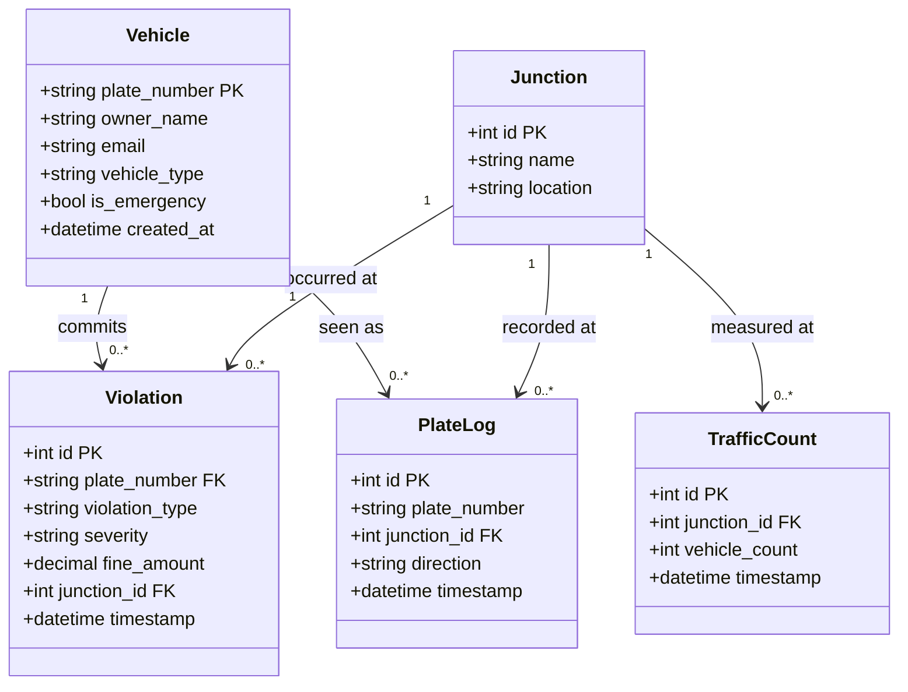

# Class Diagram: Database Entities

Reflects `database-scripts/schema.sql`.

**Notes**

- `PlateLog.plate_number` is intentionally not a foreign key to `Vehicle`:
  junction cameras log every plate they see, including unregistered
  vehicles. The `log_plate` endpoint reports registration status by looking
  the plate up in `Vehicle` separately, rather than requiring it to exist.
- `Violation.junction_id` is nullable (a violation is not always tied to a
  specific junction).
