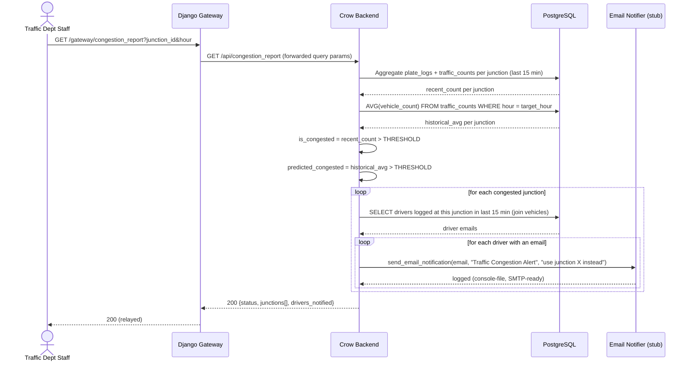

# Sequence Diagram: Congestion Detection & Alerting

```mermaid
sequenceDiagram
    actor Staff as Traffic Dept Staff
    participant Django as Django Gateway
    participant Crow as Crow Backend
    participant DB as PostgreSQL
    participant Email as Email Notifier (stub)

    Staff->>Django: GET /gateway/congestion_report?junction_id&hour
    Django->>Crow: GET /api/congestion_report (forwarded query params)

    Crow->>DB: Aggregate plate_logs + traffic_counts per junction (last 15 min)
    DB-->>Crow: recent_count per junction
    Crow->>DB: AVG(vehicle_count) FROM traffic_counts WHERE hour = target_hour
    DB-->>Crow: historical_avg per junction

    Crow->>Crow: is_congested = recent_count > THRESHOLD
    Crow->>Crow: predicted_congested = historical_avg > THRESHOLD

    loop for each congested junction
        Crow->>DB: SELECT drivers logged at this junction in last 15 min (join vehicles)
        DB-->>Crow: driver emails
        loop for each driver with an email
            Crow->>Email: send_email_notification(email, "Traffic Congestion Alert", "use junction X instead")
            Email-->>Crow: logged (console-file, SMTP-ready)
        end
    end

    Crow-->>Django: 200 {status, junctions[], drivers_notified}
    Django-->>Staff: 200 (relayed)
```
