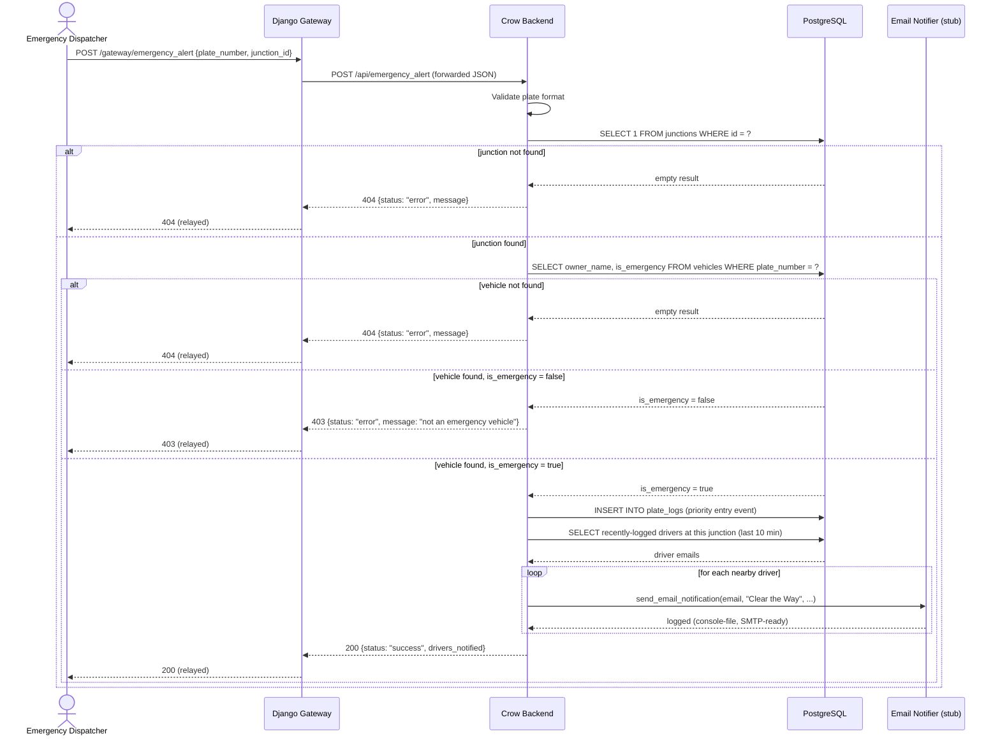

# Sequence Diagram: Emergency Vehicle Alert

```mermaid
sequenceDiagram
    actor Dispatcher as Emergency Dispatcher
    participant Django as Django Gateway
    participant Crow as Crow Backend
    participant DB as PostgreSQL
    participant Email as Email Notifier (stub)

    Dispatcher->>Django: POST /gateway/emergency_alert {plate_number, junction_id}
    Django->>Crow: POST /api/emergency_alert (forwarded JSON)

    Crow->>Crow: Validate plate format
    Crow->>DB: SELECT 1 FROM junctions WHERE id = ?
    alt junction not found
        DB-->>Crow: empty result
        Crow-->>Django: 404 {status: "error", message}
        Django-->>Dispatcher: 404 (relayed)
    else junction found
        Crow->>DB: SELECT owner_name, is_emergency FROM vehicles WHERE plate_number = ?
        alt vehicle not found
            DB-->>Crow: empty result
            Crow-->>Django: 404 {status: "error", message}
            Django-->>Dispatcher: 404 (relayed)
        else vehicle found, is_emergency = false
            DB-->>Crow: is_emergency = false
            Crow-->>Django: 403 {status: "error", message: "not an emergency vehicle"}
            Django-->>Dispatcher: 403 (relayed)
        else vehicle found, is_emergency = true
            DB-->>Crow: is_emergency = true
            Crow->>DB: INSERT INTO plate_logs (priority entry event)
            Crow->>DB: SELECT recently-logged drivers at this junction (last 10 min)
            DB-->>Crow: driver emails
            loop for each nearby driver
                Crow->>Email: send_email_notification(email, "Clear the Way", ...)
                Email-->>Crow: logged (console-file, SMTP-ready)
            end
            Crow-->>Django: 200 {status: "success", drivers_notified}
            Django-->>Dispatcher: 200 (relayed)
        end
    end
```
