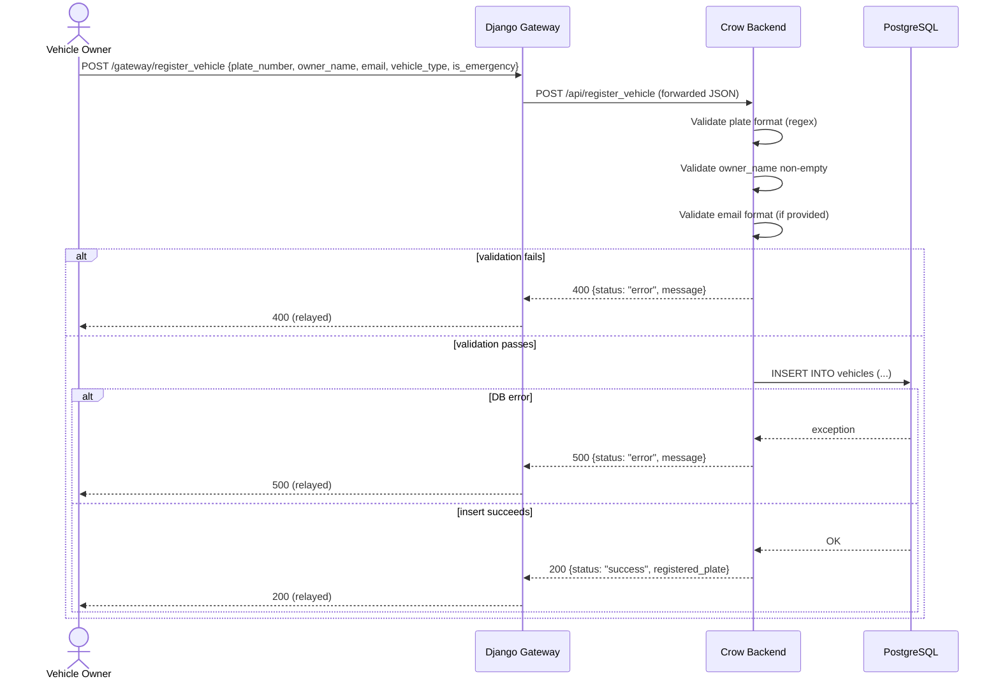

# Sequence Diagram: Register Vehicle

```mermaid
sequenceDiagram
    actor Owner as Vehicle Owner
    participant Django as Django Gateway
    participant Crow as Crow Backend
    participant DB as PostgreSQL

    Owner->>Django: POST /gateway/register_vehicle {plate_number, owner_name, email, vehicle_type, is_emergency}
    Django->>Crow: POST /api/register_vehicle (forwarded JSON)

    Crow->>Crow: Validate plate format (regex)
    Crow->>Crow: Validate owner_name non-empty
    Crow->>Crow: Validate email format (if provided)

    alt validation fails
        Crow-->>Django: 400 {status: "error", message}
        Django-->>Owner: 400 (relayed)
    else validation passes
        Crow->>DB: INSERT INTO vehicles (...)
        alt DB error
            DB-->>Crow: exception
            Crow-->>Django: 500 {status: "error", message}
            Django-->>Owner: 500 (relayed)
        else insert succeeds
            DB-->>Crow: OK
            Crow-->>Django: 200 {status: "success", registered_plate}
            Django-->>Owner: 200 (relayed)
        end
    end
```
