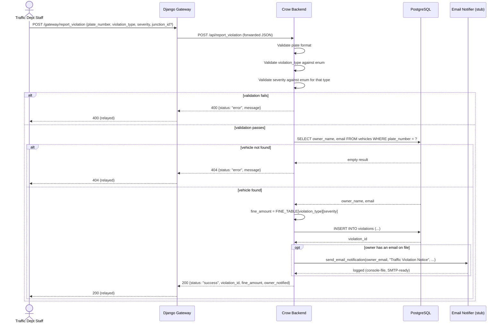

# Sequence Diagram: Report Violation

```mermaid
sequenceDiagram
    actor Staff as Traffic Dept Staff
    participant Django as Django Gateway
    participant Crow as Crow Backend
    participant DB as PostgreSQL
    participant Email as Email Notifier (stub)

    Staff->>Django: POST /gateway/report_violation {plate_number, violation_type, severity, junction_id?}
    Django->>Crow: POST /api/report_violation (forwarded JSON)

    Crow->>Crow: Validate plate format
    Crow->>Crow: Validate violation_type against enum
    Crow->>Crow: Validate severity against enum for that type

    alt validation fails
        Crow-->>Django: 400 {status: "error", message}
        Django-->>Staff: 400 (relayed)
    else validation passes
        Crow->>DB: SELECT owner_name, email FROM vehicles WHERE plate_number = ?
        alt vehicle not found
            DB-->>Crow: empty result
            Crow-->>Django: 404 {status: "error", message}
            Django-->>Staff: 404 (relayed)
        else vehicle found
            DB-->>Crow: owner_name, email
            Crow->>Crow: fine_amount = FINE_TABLE[violation_type][severity]
            Crow->>DB: INSERT INTO violations (...)
            DB-->>Crow: violation_id
            opt owner has an email on file
                Crow->>Email: send_email_notification(owner_email, "Traffic Violation Notice", ...)
                Email-->>Crow: logged (console-file, SMTP-ready)
            end
            Crow-->>Django: 200 {status: "success", violation_id, fine_amount, owner_notified}
            Django-->>Staff: 200 (relayed)
        end
    end
```
