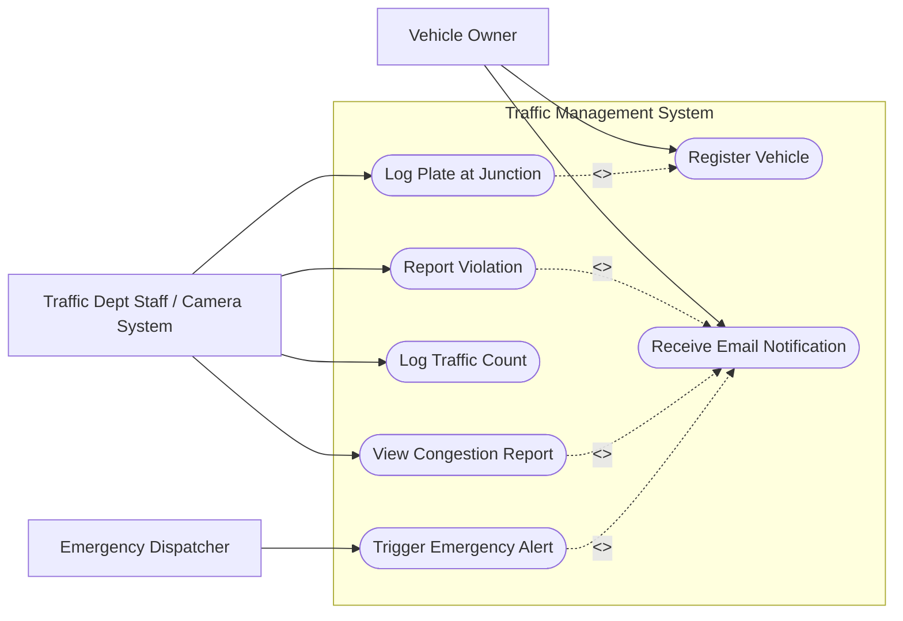

# Use Case Diagram

Covers all actors and use cases implemented across weeks 12-15. Mermaid has
no dedicated UML use-case diagram syntax, so this is drawn as a flowchart:
actors are rectangles outside the system boundary, use cases are stadium
("pill") shapes inside it, solid lines are associations, dashed labeled
arrows are `<<include>>` relationships.

**Notes**

- `Log Plate at Junction` includes a lookup against `Register Vehicle`'s data
  to determine whether the seen plate belongs to a registered vehicle.
- `Report Violation`, `View Congestion Report` (when congestion is detected),
  and `Trigger Emergency Alert` all include sending an email notification.
- `Traffic Dept Staff / Camera System` represents the source of camera feed
  data / junction sensors in this simulation (plate and count data are
  submitted directly via the API rather than through real image recognition).
